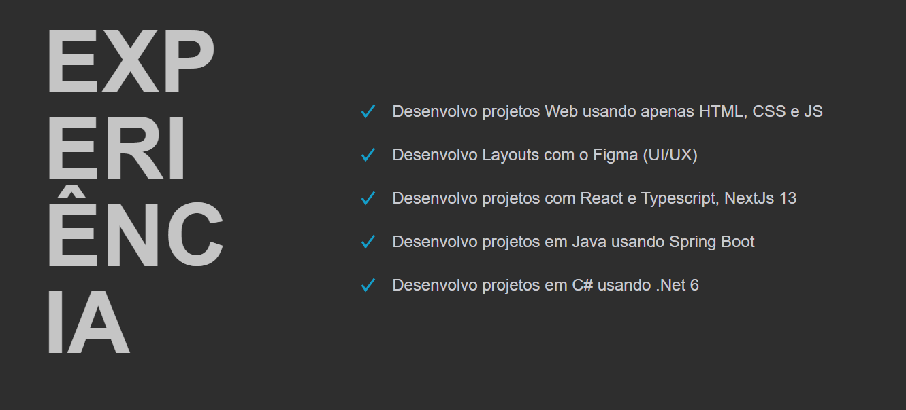

# Projeto Pessoal: Meu Portfólio de Desenvolvedor

## Sobre Mim
Olá, sou Wesley Moraes, um entusiasta de tecnologia e desenvolvedor de software FullStack. Meu interesse aprimorar interfaces web me levaram a embarcar neste projeto pessoal de construção do meu portfólio online apenas usando html e css.

## Informações Técnicas
Como desenvolvedor, tenho experiência em:

- **HTML:** Linguagem fundamental para estruturar páginas web.
- **CSS:** Utilizado para estilizar e dar vida às minhas criações.
- **JavaScript:** Utilizado em projetos pessoais.
- **Typescript:** Utilizado em todos os projetos que eu faço usando react ou next.
- **React:** Utilizado para criar projetos frontend complexos.
- **NextJs-13:** Utilizado para projetos frontEnd robustos.
- **Java:** Utilizado em ambiente de estudos.
- **C#:** Utilizado em projetos pessoais e profissionais .
- **.Net6:** Utilizado em projetos pessoais e profissionais.
- **Springboot:** Utilizado em ambiente de estudos.

## Tecnologias Utilizadas
Este projeto é focado principalmente em HTML e CSS, demonstrando minha habilidade em criar interfaces web atrativas,funcionais e responsivas.

## Progresso do Projeto

### Versão Atual: 1.0.0
Nesta versão inicial, estabeleci apenas o header da página.

### Versão Atual: 1.0.1
Nesta versão, foi desenvovido uma breve introdução sobre mim como desenvolvedor.

### Versão Atual: 1.0.2
Nesta versão, foi desenvovido minhas experiências como desenvolvedor.

### Versão Atual: 1.0.3
Nesta versão, foi desenvovido minhas competências como desenvolvedor.

### Versão Atual: 1.0.4
Nesta versão, foi desenvovido minha formação acadêmica.

### Versão Atual: 1.0.5
Nesta versão, foi desenvovido minha formas de buscar crescimento profissional na área.

### Versão Atual: 1.0.6
Nesta versão, foi desenvovido o footer do portifólio.

### Versão Atual: 1.0.7
Nesta versão, é mostrado o portifólio para diferentes dispositivos: Mobile, IPhone 5, IPhone 11

### Próximos Passos
Estou constantemente evoluindo este projeto. Os próximos passos incluem:

- Header.                    (X)
- Introdução.                (X)
- Experiência                (X)
- Competências               (X)
- Formação                   (X)
- Informações pessoais.      (X)
- Responsividade.            (X)

Fique atento para futuras atualizações e melhorias!

## Contato
Se você quiser saber mais sobre este projeto ou trocar ideias sobre desenvolvimento web, entre em contato comigo em [https://www.linkedin.com/in/owesleymoraes/](Linkedin).
